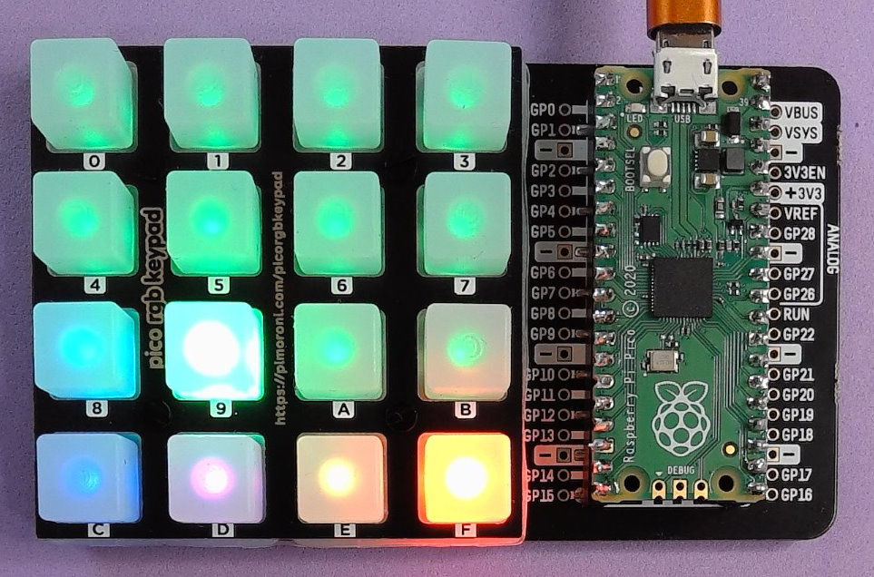

# rpico_rgb_keypad_obs

This project uses a [Pimoroni Pico RGB Keypad Base](https://shop.pimoroni.com/products/pico-rgb-keypad-base) and [Raspberry Pi Pico](https://shop.pimoroni.com/products/raspberry-pi-pico?variant=40059364311123) to create a device that appears as a USB keyboard that can be used to control OBS Studio or other software. The software will also run on a [Pimoroni Keybow 2040](https://shop.pimoroni.com/products/keybow-2040?variant=32399559622739) (with a small code change).

The keypads are mapped to keys `F13` through to `F24` (sometimes in combination with `Shift`, `Alt` and `Ctrl` keys), these keys are not usually present on modern keyboards and so should not clash with other applications.

Keypads can be configured to operate in three different modes:

1. Key, when pressed send a simple key or combination of keys. These are most useful for general control.
2. Toggle, can be in an on or off state, pressing toggles between the two sending a different key or keys depending upon the state being switched to. These key pads remain illuminated when in the on state. These are most useful for start/stop control such as start/stop streaming or recording, or to toggle sources on or off.
3. Grouped, groups a set of key pads together like a set of radio buttons. One pad in the group can be in an on state and remains illuminated. A key or combination of keys is sent when pressed. These are most useful for selecting a scene.



The default configuration (which can be changed in software) is:

| Keypad | Mode          | Colour  | Keyboard (on) | Keyboard (off) |
| ------ | ------------- | ------- | ------------- | -------------- |
| `0`    | Group (Scene) | Green   | `F13`         |                |
| `1`    | Group (Scene) | Green   | `F14`         |                |
| `2`    | Group (Scene) | Green   | `F15`         |                |
| `3`    | Group (Scene) | Green   | `F16`         |                |
| `4`    | Group (Scene) | Green   | `F17`         |                |
| `5`    | Group (Scene) | Green   | `F18`         |                |
| `6`    | Group (Scene) | Green   | `F19`         |                |
| `7`    | Group (Scene) | Green   | `F20`         |                |
| `8`    | Key           | Cyan    | `Shift + F13` |                |
| `9`    | Group (Scene) | Green   | `F21`         |                |
| `A`    | Group (Scene) | Green   | `F22`         |                |
| `B`    | Group (Scene) | Green   | `F23`         |                |
| `C`    | Key           | Cyan    | `Shift + F14` |                |
| `D`    | Toggle        | Magenta | `Ctrl + F13`  | `Alt + F13`    |
| `E`    | Toggle        | Yellow  | `Ctrl + F14`  | `Alt + F14`    |
| `F`    | Toggle        | Red     | `Ctrl + F15`  | `Alt + F15`    |

## Hardware

### Pico RGB Keypad

[Pimoroni Pico RGB Keypad Base](https://shop.pimoroni.com/products/pico-rgb-keypad-base) and [Raspberry Pi Pico](https://shop.pimoroni.com/products/raspberry-pi-pico?variant=40059364311123).

* If you use a Pico without header pins, you will need to solder header pins onto the Pico before inserting into the base.
* Alternatively a Pico with header pins will allow immediate insertion into the base

### Keybow 2040

[Pimoroni Keybow 2040](https://shop.pimoroni.com/products/keybow-2040?variant=32399559622739) 

## CircuitPython Installation

You will need to download the [CircuitPython .uf2 file](https://circuitpython.org/board/raspberry_pi_pico/) for the Pico, to install it:

1. Attach the micro USB cable to the Pico whilst holding down the `BOOTSEL` button
2. The Pico will mount as a `RPI-RP2` drive on your PC
3. Copy the downloaded `.uf2` file to the drive
4. The Pico will reboot and mount as a `CIRCUITPY` drive

## rpi_pico_rgb_keypad_osb Installation

To install the software:

1. Download the latest release ZIP from the [Releases area on GIthub](https://github.com/marjohloo/rpico_rgb_keypad/releases)
2. Unzip to your local computer
3. Copy the unzipped files to your `CIRCUITPY` drive

Note, the required libraries are included in the ZIP file.

## code.py Modifications

### Keybow 2040

To run the software on Keybow 2040 uncomment the Keybow2040 import line and comment out the RGBKeypadBase near the top of `code.py`:

```Python
from pmk.platform.keybow2040 import Keybow2040 as Hardware         # for Keybow 2040
# from pmk.platform.rgbkeypadbase import RGBKeypadBase as Hardware # for Pico RGB Keypad Base
```

### Key Configuration

The configuration that maps the keypads to the output keyboard keys is contained in the `config` array. There is one entry per key pad, the correct orientation of the keypad label board is shown in the image above.

```Python
# Hue: 
#   Set this for the pad color.
#
# Group: 
#   Set this to group pads together to operate like radio buttons (good for 
#   scene selection). You can have many separate groups of keys as set by the
#   string set for the group
#
# Keycodes On: 
#   These are the keyboard codes to be sent for normal, grouped and toggle on 
#   pads.
# 
# Keycodes Off: 
#   These are the keyboard codes to be sent for toggle off pads, setting this 
#   makes a toggle button, good for start/stop streaming
#
# Note: 
#   Pads configured as toggles will be removed from any groups
#
config = [
    {"hue": hue["green"]  , "group": "scene", "keycodes_on": [Keycode.F13],                  "keycodes_off": None                      }, # 0
    {"hue": hue["green"]  , "group": "scene", "keycodes_on": [Keycode.F14],                  "keycodes_off": None                      }, # 1
    {"hue": hue["green"]  , "group": "scene", "keycodes_on": [Keycode.F15],                  "keycodes_off": None                      }, # 2
    {"hue": hue["green"]  , "group": "scene", "keycodes_on": [Keycode.F16],                  "keycodes_off": None                      }, # 3
    {"hue": hue["green"]  , "group": "scene", "keycodes_on": [Keycode.F17],                  "keycodes_off": None                      }, # 4
    {"hue": hue["green"]  , "group": "scene", "keycodes_on": [Keycode.F18],                  "keycodes_off": None                      }, # 5
    {"hue": hue["green"]  , "group": "scene", "keycodes_on": [Keycode.F19],                  "keycodes_off": None                      }, # 6
    {"hue": hue["green"]  , "group": "scene", "keycodes_on": [Keycode.F20],                  "keycodes_off": None                      }, # 7
    {"hue": hue["cyan"]   , "group": None   , "keycodes_on": [Keycode.SHIFT,   Keycode.F13], "keycodes_off": None                      }, # 8
    {"hue": hue["green"]  , "group": "scene", "keycodes_on": [Keycode.F21],                  "keycodes_off": None                      }, # 9
    {"hue": hue["green"]  , "group": "scene", "keycodes_on": [Keycode.F22],                  "keycodes_off": None                      }, # A
    {"hue": hue["green"]  , "group": "scene", "keycodes_on": [Keycode.F23],                  "keycodes_off": None                      }, # B
    {"hue": hue["blue"]   , "group": None   , "keycodes_on": [Keycode.SHIFT,   Keycode.F14], "keycodes_off": None                      }, # C
    {"hue": hue["magenta"], "group": None   , "keycodes_on": [Keycode.CONTROL, Keycode.F13], "keycodes_off": [Keycode.ALT, Keycode.F13]}, # D
    {"hue": hue["yellow"] , "group": None   , "keycodes_on": [Keycode.CONTROL, Keycode.F14], "keycodes_off": [Keycode.ALT, Keycode.F14]}, # E
    {"hue": hue["red"]    , "group": None   , "keycodes_on": [Keycode.CONTROL, Keycode.F15], "keycodes_off": [Keycode.ALT, Keycode.F15]}  # F
]
```

### Disable Keyboard

Sometimes it can be useful when working on the code to block the sending of keyboard presses, to avoid sending problem keystroke to the system. Whilst disable the software will output the keycodes that would be sent on the serial port.

## code.py Libraries

The code makes use of the following libraries (these are included in the release ZIP and also the Github repository):

* https://circuitpython.org/libraries
  * lib/adafruit_dotstar.mpy
  * lib/adafruit_hid/
* https://github.com/pimoroni/pmk-circuitpython
  * lib/pmk/

# Notices

Copyright (c) 2023 Martin Looker

This code is released under the MIT license, see the [LICENSE](https://github.com/marjohloo/rpico_rgb_keypad/blob/main/LICENSE) file for details.